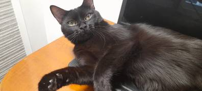

# test-git
Projecte de prova per practicar GIT &amp; Markdown

## Descripció

Aquest es un exercici de git i markdown. Afegirem a aquest projecte una **web** per poder fer servir la funcionalitat de github que s'anomena [github pages](https://pages.github.com/)

## Coses que es valoraran:
* les captures de pantalla
* el fitxer de markdown ben fet
* publicar la web a git

I ara la foto d'un *gatete*:

